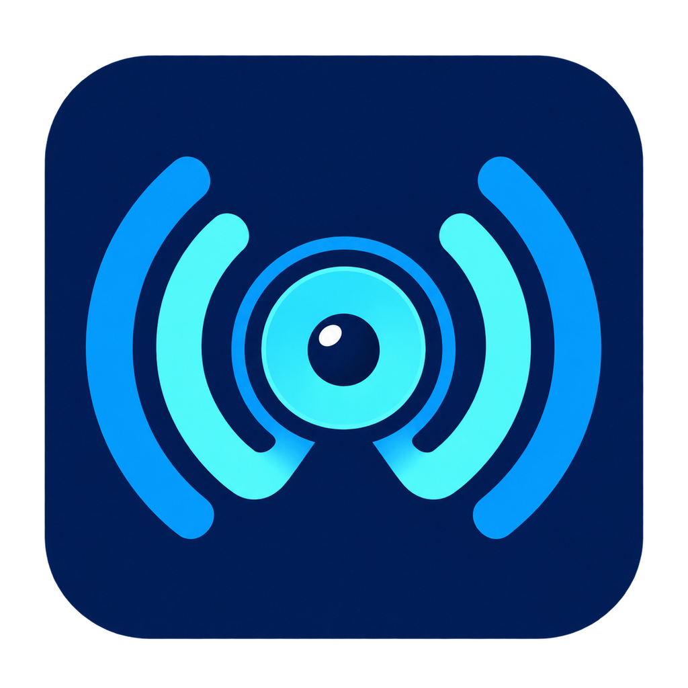

# AirPlayWin 1.0

[English](README.md) | **简体中文**

<p align="center">
  
</p>

AirPlayWin 是一个面向 Windows 11 x64 的原生 Classic AirPlay/RAOP 音频接收器。它可以让
iPhone、iPad 和 Mac 将 Windows 电脑识别为无线音箱，并通过默认扬声器、耳机、USB DAC、
HDMI 或指定的 Windows 音频端点播放 Apple Lossless（ALAC）或 L16 音频。

当前稳定版为 **v1.0.1**。它采用 C++23、CMake、Winsock2/IOCP、WASAPI、QPC、Windows
CNG 和 Media Foundation 实现，核心音频引擎与协议、平台及未来 UI 层保持解耦。

> [!IMPORTANT]
> v1.0.1 支持的是经过实际播放验证的 **Classic AirPlay/RAOP 音频**，不是完整 AirPlay 2。
> 现代 Pairing/FairPlay、完整 PTP、多主机多房间、视频投屏和 WinUI 尚未包含在稳定版中。

## 主要功能

- Windows 原生 DNS-SD 广播，无需安装 Bonjour。
- iPhone、iPad、Mac 可在 AirPlay 设备列表中发现 Windows 电脑。
- Classic RAOP 实时音频，支持 Apple Lossless（ALAC）和 L16。
- 使用 Windows CNG 完成 legacy RSA-AES 会话密钥处理和 AES-128-CBC 音频解密。
- Media Foundation ALAC 解码。
- WASAPI Shared Mode、Event-Driven 播放。
- 支持默认音频设备和指定音频端点。
- 默认设备切换、设备拔出和重新插入后的恢复框架。
- 手机端音量同步至 Windows 音量合成器中的 `AirPlayWin.exe` 会话。
- Fade-In/Fade-Out、音量 Sample Ramp、Underrun Ramp-To-Zero 和静音预热。
- Audio Epoch 隔离，阻止旧时间线 PCM 进入新播放会话。
- NaN/Inf、越界幅度和基础 DC Offset 检测。
- 运行时诊断、实时日志、单实例保护和优雅停止。
- Windows Private 网络范围的程序级防火墙规则。

## 下载与安装

从 [GitHub Releases](https://github.com/SunXiaomin916/AirPlayWin/releases/latest) 下载：

- `AirPlayWin-1.0.1-windows-x64.zip`
- `AirPlayWin-1.0.1-windows-x64.zip.sha256`

下载后可先验证 SHA-256：

```powershell
Get-FileHash .\AirPlayWin-1.0.1-windows-x64.zip -Algorithm SHA256
```

解压 ZIP，以管理员身份打开 PowerShell，然后运行：

```powershell
Set-ExecutionPolicy -Scope Process Bypass
.\installer\Install-AirPlayWin.ps1 -EnableStartup
```

安装程序会：

- 将程序安装到 `%LOCALAPPDATA%\Programs\AirPlayWin`；
- 创建“AirPlayWin”和“Stop AirPlayWin”开始菜单快捷方式；
- 按需创建当前用户的隐藏启动项；
- 为程序创建仅限 Windows Private 网络配置文件的入站规则。

如果只想做本机诊断、暂时不修改防火墙，可以使用 `-SkipFirewall`。这种情况下，iPhone
等局域网设备可能无法发现或连接电脑。

## 使用方法

1. 确认 Windows 网络配置文件设置为“专用网络”。
2. 从开始菜单运行“AirPlayWin”。
3. 确保 iPhone/iPad/Mac 与电脑位于同一个可信局域网。
4. 在 iPhone 控制中心或音乐应用中打开 AirPlay 设备列表。
5. 选择 `AirPlayWin`，然后开始播放音乐。

手机音量会映射到：

```text
Windows 设置 → 系统 → 声音 → 音量合成器 → AirPlayWin.exe
```

要停止后台接收器，可运行开始菜单中的“Stop AirPlayWin”，或者执行：

```powershell
& "$env:LOCALAPPDATA\Programs\AirPlayWin\AirPlayWin.exe" --stop
```

运行日志保存在：

```text
%LOCALAPPDATA%\AirPlayWin\Logs
```

## 卸载

以管理员身份运行：

```powershell
& "$env:LOCALAPPDATA\Programs\AirPlayWin\installer\Uninstall-AirPlayWin.ps1"
```

卸载脚本会先请求接收器优雅退出，然后删除防火墙规则、启动项、快捷方式和安装目录。

## 常用命令

在源码构建目录中：

```powershell
$app = ".\build\vs2022-x64\Release\AirPlayWin.exe"

# 查看版本
& $app --version

# 枚举音频输出设备
& $app --list-devices

# 使用默认设备播放 440 Hz 测试音
& $app --play --signal 440 --duration 10

# 启动 Classic RAOP 接收器
& $app --serve --name "Living Room PC" --run-until-stopped

# 将诊断信息写入 UTF-8 日志
& $app --serve --run-until-stopped --log-file .\AirPlayWin.log

# 停止正在运行的接收器
& $app --stop

# 查看防火墙规则状态
& $app --firewall-status
```

使用指定音频设备：

```powershell
& $app --serve --device "{endpoint-id}" --run-until-stopped
```

默认情况下只发布稳定的 `_raop._tcp` 服务并监听 TCP 5000。未完成的双服务协议测试路径
必须显式使用 `--experimental-airplay2`，不建议日常使用。

## 从源码构建

### 环境要求

- Windows 11 x64
- Visual Studio 2022，安装“使用 C++ 的桌面开发”工作负载
- CMake 3.26 或更高版本
- Windows SDK

### 配置、编译与测试

在 Visual Studio Developer PowerShell 中运行：

```powershell
cmake --preset vs2022-x64
cmake --build --preset debug --parallel
ctest --preset debug

cmake --build --preset release --parallel
ctest --preset release
```

工程使用 `/W4 /WX`，警告会被当作错误处理。

从干净 Git 工作区生成并验证发布包：

```powershell
.\tools\New-ReleasePackage.ps1
```

发布脚本会自动执行 Release 编译、测试、版本检查、日志检查、CPack 打包、包内容验证、
SHA-256 校验和发布清单生成。也支持使用正式 Authenticode 证书签名。

## 架构

```text
src/
├── core/
│   ├── audio/        音频引擎、Ring Buffer、Epoch、防爆音与解码抽象
│   ├── protocol/     RTSP/SDP 会话与请求处理
│   ├── transport/    RTP、Jitter Buffer 与网络故障注入
│   ├── discovery/    DNS-SD 服务记录和网卡策略
│   ├── timing/       RTP/QPC、实验性 PTP 与时钟伺服
│   ├── group/        实验性组同步协调与端点校准
│   ├── crypto/       鉴权和 RAOP 加密抽象
│   └── lifecycle/    恢复协调
├── platform/windows/
│   ├── audio/        WASAPI、Media Foundation 与设备枚举
│   ├── network/      IOCP、DNS-SD 和 RTP UDP
│   ├── crypto/       Windows CNG
│   ├── timing/       QPC 与实验性 PTP
│   └── system/       防火墙、电源事件和单实例
└── app/              命令行组合入口
```

协议代码不能直接调用 WASAPI。所有 PCM 都必须经过 `AudioEngine`、Audio Epoch 和
`AudioTransitionGuard`，最后才进入 Windows 音频后端。实时音频线程避免动态分配、文件
IO、网络操作、日志格式化和长时间持锁。

## 测试与验证

- Debug 和 Release x64 均通过 `/W4 /WX` 编译。
- 单元测试、同步回归、防爆音回归、延迟分析和版本门禁均通过。
- 已使用真实 iPhone 验证 Apple Music 和 QQ 音乐播放。
- 已验证手机音量与 Windows `AirPlayWin.exe` 音量会话同步。
- 已完成 30 分钟默认端点静音稳定性测试以及多轮播放状态转换回归。

端点切换、USB DAC 热插拔、睡眠恢复和不同网卡/驱动组合仍属于硬件相关验收项目，建议在
目标电脑上保留日志并单独验证。详细验收要求见 [docs/release.md](docs/release.md)。

## 安全说明

v1.0.1 没有实现 AirPlay Pairing、PIN 或每个发送端的授权。任何能够访问接收器 TCP 5000
和协商后 UDP 端口的兼容设备都可能尝试控制播放。因此：

- 只应在可信的 Windows Private 网络中运行；
- 不要把端口转发到互联网；
- 不要在公共 Wi-Fi 上开放防火墙规则；
- 不使用时请停止接收器。

完整说明见 [SECURITY.md](SECURITY.md)。

## 当前限制

- 不支持现代 AirPlay 2 Pairing/FairPlay。
- 不支持完整双向 PTP 和正式多房间播放。
- 不支持视频、屏幕镜像或照片投送。
- 尚无 WinUI 图形界面。
- 正式 ZIP 当前未使用生产 Authenticode 证书签名。
- 当前仓库尚未附带开源许可证；源码公开可见不等于自动授予复制、修改或再分发权利。

各阶段的完整设计、测试数据和实验功能说明可继续查阅英文 [README](README.md) 以及
[`docs/`](docs/) 目录。
